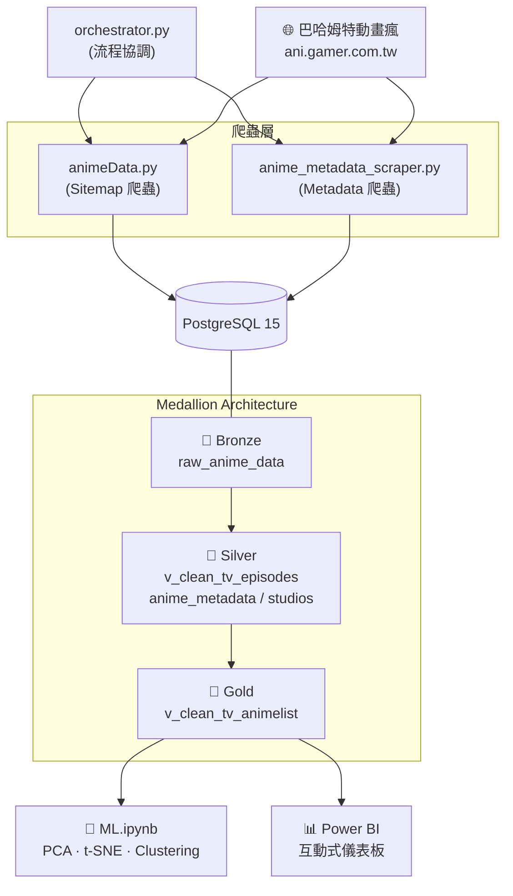
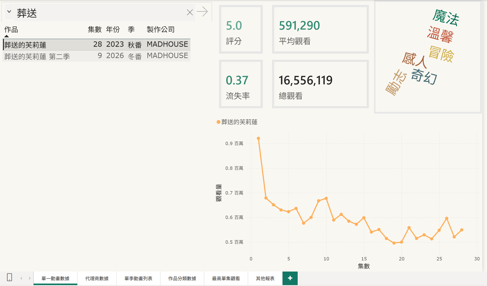
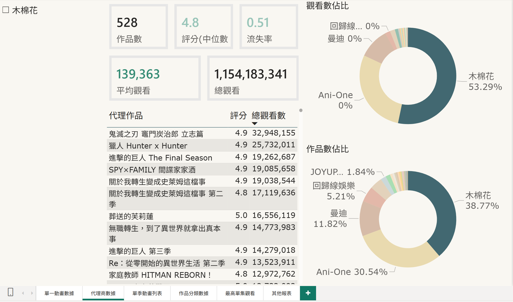
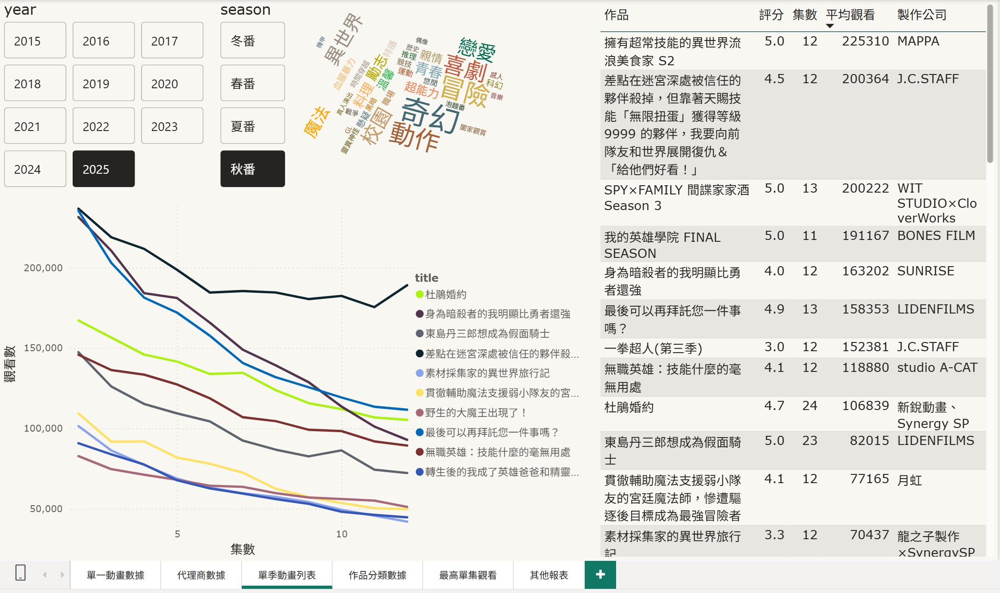
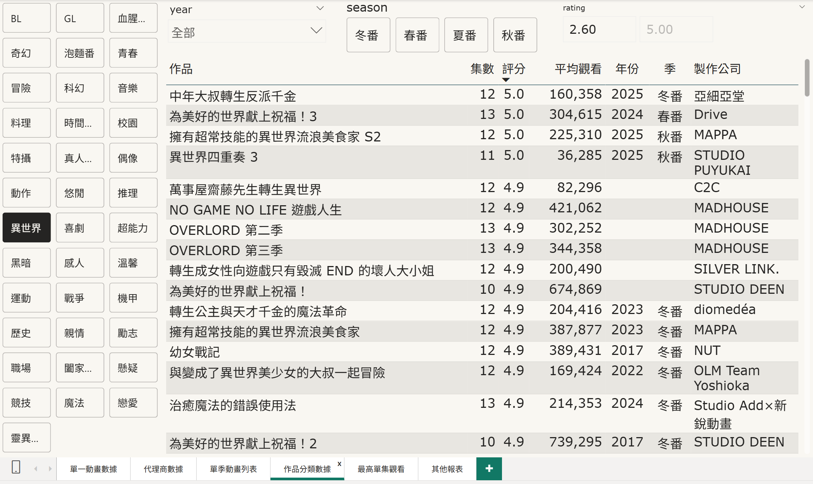
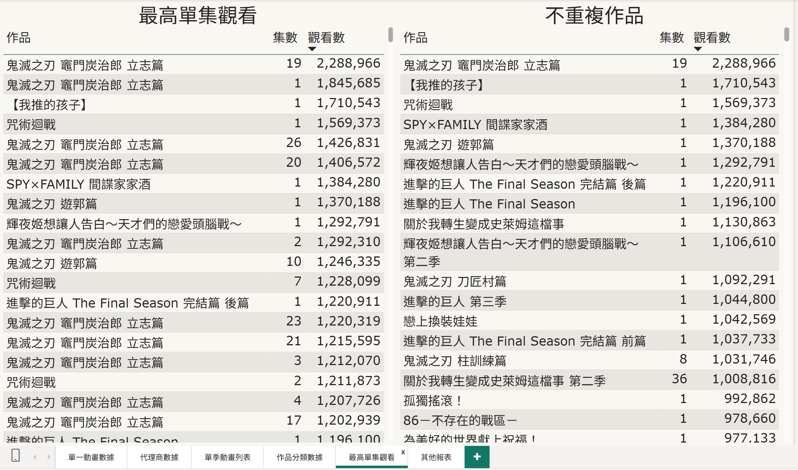
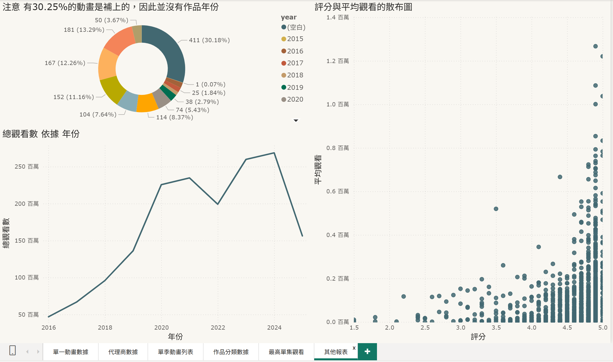

# 巴哈姆特動畫瘋 — 資料工程與機器學習分群分析


## 目錄

- [專案簡介](#專案簡介)
- [架構總覽](#架構總覽)
- [技術棧](#技術棧)
- [資料管線](#資料管線)
  - [第一階段：Sitemap 爬蟲](#第一階段sitemap-爬蟲-animedatapy)
  - [第二階段：Metadata 爬蟲](#第二階段metadata-爬蟲-anime_metadata_scraperpy)
  - [協調器](#協調器-orchestratorpy)
- [資料倉儲設計](#資料倉儲設計)
  - [Medallion 分層架構](#medallion-分層架構)
  - [Silver 層：集數級清洗視圖](#silver-層集數級清洗視圖-v_clean_tv_episodes)
  - [Gold 層：作品級聚合視圖](#gold-層作品級聚合視圖-v_clean_tv_animelist)
  - [製作公司正規化](#製作公司正規化)
- [關鍵指標定義](#關鍵指標定義)
- [機器學習分析](#機器學習分析)
  - [資料前處理](#1-資料前處理)
  - [描述統計與探索式分析](#2-描述統計與探索式分析)
  - [特徵工程](#3-特徵工程)
  - [降維](#4-降維)
  - [分群](#5-分群)
  - [分群結果解讀](#6-分群結果解讀)
  - [內容推薦](#7-內容推薦)
- [Power BI 儀表板](#power-bi-儀表板)
- [快速開始](#快速開始)
- [專案結構](#專案結構)

---

## 專案簡介

**動機：**

會製作這個專案的動機其實很單純，一是為了充實自己的實作經驗，因為想要找到數據分析師、資料科學家相關工作；二是我想要從自己熟悉且感興趣的題材開始下手，於是就有了這個專案。

**簡介：**

本專案是一個針對**巴哈姆特動畫瘋 (AniGamer)** 平台的端到端 (End-to-End) 資料工程與機器學習分析系統。

核心目標在於建立一套自動化的數據管線，將非結構化的網頁資料轉化為具備商業洞察價值的結構化資產。本專案不只是單純的資料抓取，更導入了 **Medallion Architecture (獎章架構)** 進行資料治理，並結合**非監督式機器學習**對動畫作品進行特徵降維與分群，最終透過 **Power BI** 提供視覺化的決策支援。

*   **自動化數據管線 (Automated Pipeline)**：利用協調器 (Orchestrator) 串接二階段爬蟲，補完 Sitemap 缺失的代理商、製作廠商及分類標籤等關鍵中繼資料 (Metadata)。
*   **資料倉儲設計**：在 PostgreSQL 中實作 **Bronze/Silver/Gold** 分層架構，並透過 SQL Views 實施複雜的資料清洗與正規化，確保資料的一致性 (Data Integrity)。
*   **數據分析**：經過合適的特徵工程，並應用機器學習演算法（降維與分群），挖掘動畫作品間的潛在關聯，並以此為基礎建構內容推薦邏輯。
*   **資料視覺化**：將資料庫端產出的金層 (Gold Layer) 數據對接 Power BI，實現指標監控與分群結果的直觀呈現。

---

## 架構總覽



---

## 技術棧

| 領域 | 工具 |
|:---|:---|
| 程式語言 | Python 3.11 |
| 資料擷取 | requests, BeautifulSoup4, lxml (HTML/XML 解析) |
| 資料處理 | pandas, NumPy |
| 資料庫 | PostgreSQL 15, SQLAlchemy 2.0, psycopg2 |
| 容器化 | Docker, Docker Compose |
| 機器學習 | scikit-learn (PCA, t-SNE, HDBSCAN, Agglomerative Clustering) |
| 視覺化 | matplotlib, seaborn, dython (相關係數熱力圖) |
| BI 報表 | Power BI Desktop (直連 PostgreSQL) |

---

## 資料管線

### 第一階段：Sitemap 爬蟲 (`animeData.py`)

從巴哈姆特動畫瘋的 `sitemap.xml` 擷取所有影片的結構化資料，每一筆記錄對應一集影片。

**擷取欄位：**

| 欄位 | 說明 |
|:---|:---|
| `loc` | 影片頁面 URL（作為主鍵） |
| `video_title` | 含集數及標題的原始標題 |
| `video_publication_date` | 上架日期 |
| `video_rating` | 觀眾評分（1.0–5.0） |
| `video_duration` | 影片時長（秒） |
| `video_view_count` | 觀看次數 |
| `video_restricted` | 觀看地區限制 |

**清洗邏輯（Python 端）：**

爬蟲在寫入資料庫前，會對原始標題進行一系列正規表達式處理：

1. HTML 實體還原（`&#039;` → `'`）
2. 標記特徵擷取：`R18`（年齡限制版）、`video_type`（電影/特別篇）、`video_language`（中文配音/台語/粵語）
3. 集數標籤擷取：從標題末尾的 `[n]` 提取 `episode_label`，並轉換為可排序的數值 `episode_sort`（支援 `1A` → `1.1` 格式）
4. 清潔標題：移除所有已提取的方括號標籤，保留作品核心名稱

**寫入方式：** 使用 PostgreSQL `ON CONFLICT DO UPDATE` (Upsert)，以 `loc` 為主鍵，確保重複執行時能更新觀看數與評分等動態欄位而非重複插入。

### 第二階段：Metadata 爬蟲 (`anime_metadata_scraper.py`)

第二支爬蟲的任務是補全每部動畫的 **代理廠商、製作廠商、分類標籤**。

**為什麼需要兩階段？**
Sitemap 中每一集都是獨立的 URL，但代理廠商、製作公司、分類標籤等 metadata 在同一部動畫的每集頁面中是完全相同的。若直接逐集爬取會大量重複請求。因此第二支爬蟲是以 Gold 層視圖 `v_clean_tv_animelist` 中已彙整好的 **作品級 URL** 為基礎，透過 `LEFT JOIN anime_metadata` 篩選出尚未爬取的作品，避免重複請求。

**解析方式：** 使用 BeautifulSoup 解析 HTML DOM，從 `<li class="type">` 節點中分別提取代理廠商、製作廠商（`<p class="content">`）和分類標籤（`<ul class="tag-list">`）。

**寫入方式：** `INSERT ... ON CONFLICT (url) DO NOTHING`，避免重複寫入。

**防封鎖機制：**
- 隨機休息間隔（0.5 ~ 1.0 秒）
- 指數退避重試策略（最多 3 次，應對 429/5xx 錯誤）
- 支援 `--dry-run` 測試模式與 `--limit` 控制爬取量

### 協調器 (`orchestrator.py`)

`orchestrator.py` 是一個輕量的流程調度器，依序執行兩支爬蟲，並在兩者之間加入延遲與健康檢查。

**執行流程：**

```
啟動 → 檢查 DB 連線 → 執行 animeData.py → 檢查是否有新資料
                                                  │
                                   有 ─────► 等待 30 秒 → 執行 anime_metadata_scraper.py → 完成
                                   無 ─────► 跳過第二階段 → 完成
```

- 支援 `STOP_ON_FIRST_FAILURE` 環境變數控制失敗行為
- 支援 `CRAWLER_DELAY` 配置兩階段之間的延遲秒數

---

## 資料倉儲設計

### Medallion 分層架構

本專案採用類似 Medallion Architecture 的三層資料模型，在 PostgreSQL 中以資料表與視圖實現：

| 層級 | 物件 | 說明 |
| :---: |:---|:---|
| **Bronze** | `raw_anime_data` | 爬蟲直接 Upsert 的原始資料，每列 = 一集影片 |
| **Silver** | `v_clean_tv_episodes` | 集數級清洗視圖，合併同集多版本（如年齡限制版），排除電影/特別篇/配音版 |
| | `anime_metadata` | 第二支爬蟲寫入的代理廠商、製作廠商、分類標籤 |
| | `studios` + `studio_aliases` + `anime_studio_map` | 製作公司正規化表群 |
| **Gold** | `v_clean_tv_animelist` | 作品級聚合視圖，包含衍生指標（流失率、類型、季度等） |

### Silver 層：集數級清洗視圖 (`v_clean_tv_episodes`)

此視圖解決的數據品質問題：

- **多版本合併**：同一集可能存在普通版與年齡限制版，視圖取 `MAX(view_count)` 作為該集代表觀看數
- **副集排除**：排除 `episode_sort` 為 `.5` 的副集（如 6.5 集）
- **非 TV 排除**：排除電影、特別篇、中文/台語/粵語配音版本

**核心邏輯：** 使用三階段 CTE（Common Table Expression）：
1. `VersionRepresentatives`：按 (作品名, 主集數) 分組，取各版本的最大觀看數
2. `TotalMetrics`：對同一集的普通/R18 版本做 SUM 合併
3. `CanonicalInfo`：以 `DISTINCT ON` 取每集的標準 URL、發布日期、評分

### Gold 層：作品級聚合視圖 (`v_clean_tv_animelist`)

將集數級資料彙整為 **每部動畫一列** 的分析表，供 Power BI 儀表板與 ML 分析共用。

**衍生欄位：**

| 欄位 | 計算邏輯 |
|:---|:---|
| `episodes` | `COUNT(*)` — 總集數 |
| `mean_view_count` | `AVG(view_count)` — 每集平均觀看數 |
| `sum_view_count` | `SUM(view_count)` — 總觀看數 |
| `churn_rate` | 觀眾流失率（詳見[關鍵指標定義](#關鍵指標定義)） |
| `type` | 依集數分級：短篇動畫 (≤6)、季番 (≤15)、半年番 (≤30)、長篇動畫 (>30) |
| `year` / `season` | 以首播日期 +14 天推算播出年份與季度（冬番/春番/夏番/秋番） |
| `frequency` | 更新頻率（hourly / daily / weekly） |
| `aired_weekly` | 是否為週播（首播日 ≠ 末播日） |

### 製作公司正規化

動畫瘋頁面上同一間製作公司可能有多種寫法（例如 `J.C.STAFF`、`J.C. STAFF`、`J.C.STAFF ​​​`），且部分動畫為多公司共同製作（以「、」或「×」分隔）。

為解決此問題，設計了三張正規化表：

```
anime_metadata.studio ──(正規表達式拆分)──► anime_studio_map ──► studios
        "A×B"                                 anime_url + studio_id    正式名稱
                                                     ▲
                                              studio_aliases
                                              (別名 → studio_id)
```

| 表格 | 用途 |
|:---|:---|
| `studios` | 正式公司名單（260+ 間） |
| `studio_aliases` | 別名對應表（將各種寫法映射到同一 `studio_id`） |
| `anime_studio_map` | 作品與公司的多對多關聯，使用 `regexp_split_to_table` 拆分原始字串 |

---

## 關鍵指標定義

### 觀眾流失率 (Churn Rate)

量化「觀眾從第一集到最終集流失了多少比例」的指標：

$$
\text{Churn Rate} = \frac{\displaystyle\sum_{i=2}^{n} \max\left(\frac{V_1 - V_i}{V_1},\ 0\right)}{n - 1}
$$

- $V_1$：第一集觀看數
- $V_i$：第 $i$ 集觀看數
- $n$：總集數

流失率越高，代表觀眾棄番越嚴重；越低則代表觀眾黏著度越強。只有 1 集的作品回傳 `N/A`。

---

## 機器學習分析

分析流程記錄在 `ML.ipynb` 中，以 Jupyter Notebook 形式呈現完整的 EDA → 特徵工程 → 分群 → 解讀過程。

### 1. 資料前處理

- **資料合併**：以作品名稱（`title`）將 Gold 層視圖與 metadata 表 `INNER JOIN`
- **特徵選擇**：保留 `type`（作品類型）、`rating`（評分）、`churn_rate`（流失率）、`mean_view_count`（平均觀看數）、`tags`（分類標籤）、`r18`
- **標籤 One-Hot 編碼**：將 JSONB 格式的 `tags` 展開為二元特徵矩陣（如「冒險」「奇幻」「校園」等）
- **類型有序編碼**：`type` 按 短篇動畫(0) → 季番(1) → 半年番(2) → 長篇動畫(3) 編碼
- **資料清洗**：排除「真人演出」類作品

### 2. 描述統計與探索式分析

- 繪製各標籤的長條圖與圓餅圖，觀察分佈是否平衡
- 流失率直方圖（含 KDE 密度估計）
- 評分 vs 平均觀看數的聯合散佈圖（Joint Plot）
- 使用 [dython](https://github.com/shakedzy/dython) 計算包含名目變數的關聯矩陣（Theil's U）繪製熱力圖，識別高相關特徵（如「競技」與「運動」高度相關）
- **稀疏特徵移除**：刪除出現次數 < 50 的標籤與高相關冗餘特徵（如移除「運動」保留「競技」），篩選後保留 25 個二元特徵

### 3. 特徵工程

**連續變數標準化：**

| 特徵 | 轉換方式 |
|:---|:---|
| `mean_view_count` | $\log_{10}$ 轉換 → StandardScaler |
| `rating` | Box-Cox 轉換（PowerTransformer） |
| `churn_rate` | StandardScaler |

**類別變數加權：**

標準化後的連續變數變異數為 1，而二元變數的變異數為 $p(1-p)$（約 0.09 ~ 0.21），在 PCA 中影響力自然較低。為了讓 25 個二元標籤特徵的總影響力約等於 2 個連續變數，對所有標籤特徵與 `type_ord` 統一乘以 **0.7** 的權重。

### 4. 降維

**PCA（主成分分析）：**
- 計算累積解釋變異量，取前 **6 個主成分**（達到約 80% 解釋力）
- 透過 Scree Plot 觀察後續主成分的邊際貢獻遞減

**t-SNE（2D 視覺化）：**
- 將 6 維 PCA 結果投影到 2D（perplexity=40），用以視覺化散佈圖
- 分別以觀看數、評分、流失率著色，直觀觀察資料結構

### 5. 分群

**嘗試一：HDBSCAN**

首先使用 HDBSCAN（`min_cluster_size=20, min_samples=1`），理由是密度分群能捕捉不規則形狀的群集。然而結果中噪音標籤（`-1`）佔比過高，大量作品無法被分配到有效群集，因此改用其他方法。

**嘗試二：凝聚式階層分群（Agglomerative Clustering, Ward's Method）**

改用由下而上的階層式分群，先繪製樹狀圖（Dendrogram）確認合理的分群範圍，再逐一計算 6 ~ 12 群的輪廓係數（Silhouette Score）：

| 群數 | 6 | 7 | 8 | 9 | 10 | 11 | 12 |
|:---:|:---:|:---:|:---:|:---:|:---:|:---:|:---:|
| 輪廓係數 | 0.1753 | 0.1348 | 0.1285 | 0.1319 | 0.1318 | 0.1363 | 0.1369 |

> 先以 **9 群**進行初步解讀；隨後在人工檢查代表作品時發現，9 群中某些群的內部異質性仍偏高（例如子供向與長篇 IP 被混在同一群，頂流大作與校園話題作也未被區別），因此進一步嘗試 **12 群**。12 群不僅輪廓係數更高，且各群的語義解釋更為清晰，故最終採用 **12 群**作為結論。

### 6. 分群結果解讀

透過計算各群在連續特徵（觀看數 / 評分 / 流失率）的平均值與前五大標籤特徵，並以離群心最近的作品作為代表，歸納出以下 **12 種觀眾行為群落**：

| 群組 | 分群邏輯 | 代表作品 | 關鍵數據特徵（標準化後） |
|:---:|:---|:---|:---:|
| 0 | **開高走低的過客**：有強大原作或初期話題撐腰，但動畫化品質中庸或原作有爭議，觀眾中途流失明顯 | 偵探已經，死了。、一拳超人 S2、出租女友 | 評分偏低 (-0.727)・流失率普通 |
| 1 | **數據黑洞（雷區）**：典型「慘遭動畫化」或極度冷門作，觀看與評分雙雙觸底 | Praeter 之傷、美麗新世界、蒼翼默示錄 | 評分最低 (-1.635)・流失極高 (1.254) |
| 2 | **精準受眾（短平快）**：篇幅短、受眾精準（福利向 / 純愛短篇 / 迷因短劇），不求出圈 | 無意間變成狗、新來的女傭有點怪 | 均觀低 (-1.071)・篇幅最短 (0.798) |
| 3 | **穩定奇幻基本盤**：標準的奇幻冒險，表現穩健且中規中矩 | 勇者辭職不幹了、赤髮白雪姬、發條精靈戰記 | 各指標落在正常範疇 |
| 4 | **校園戀愛與日常喜劇**：口碑不錯、作品調性偏日常或搞笑 | 男子高校生的日常、柑橘味香氣、鹿乃子 | 評分略高 |
| 5 | **經典王道 / 熱門長篇**：流量穩定且品質優秀的王道大作 | 炎炎消防隊、王者天下、我推的孩子 | 篇幅長但續看率不低 |
| 6 | **冷門神作 / 舒壓喜劇**：流量不如頂流，但評價極高的「純粹好作品」 | 江戶前精靈、琉璃的寶石、路人超能100 S2 | 評分最高 (1.067)・流失率低 (-0.504) |
| 7 | **時代的敗北者**：IP 深耕已久的長壽作品，在動畫瘋上卻乏人問津 | 蠟筆小新、我們這一家、怪醫黑傑克 | 篇幅最長・觀看率低落 |
| 8 | **異世界爽片（黏著型）**：標籤高度一致（異世界 / 系統流），評價低但爽快感強，流失率意外地低 | 手機俠 2、最強肉盾、轉生蜘蛛 | 評分極低 (-1.615)・流失卻低 (-0.490) |
| 9 | **子供向作品**：在動畫瘋上的邊緣存在，幾乎不被主流觀眾關注 | 小不點、Hello Kitty、壽司大相撲 | 均觀最低 (-2.729)・流失率最高 (1.987) |
| 10 | **頂流霸權奇幻大作**：平台上的流量支柱，品質與人氣兼具 | 鬼滅之刃、葬送的芙莉蓮、地城邂逅 | 均觀最高 (1.277)・評分與流失率兼優 |
| 11 | **校園題材的話題大作**：同為大熱門，但題材以校園戀愛為主，與第 10 群形成題材上的對比 | 果青、我心危、輝夜姬、敗北女角 | 均觀很高 (0.993)・評分僅次第 6 群・流失極低 |

> **9 群 → 12 群的改善重點：**
> - 原第 0 群（「數據孤兒」）被拆分為第 7 群（長壽IP）與第 9 群（子供向），兩者在作品性質上截然不同
> - 原第 1 群（「頂流霸權」）被拆分為第 10 群（奇幻大作）與第 11 群（校園話題作），反映了高人氣作品內部的題材差異
> - 原第 2 群（「穩定商業向」）被拆分為第 4 群（校園日常喜劇）與第 5 群（王道長篇），區分了篇幅與受眾定位

### 7. 內容推薦

基於分群後的特徵空間，實現兩種相似度計算方式：

- **歐氏距離**：直接以特徵向量間的 $L_2$ 距離衡量
- **餘弦相似度**：以向量夾角衡量，更適合高維稀疏特徵

輸入任一動畫名稱，即可查詢最相似的 Top-K 作品及其距離值。

---

## Power BI 儀表板

使用 Power BI Desktop 連接 PostgreSQL（以匯入模式），打造六頁互動式資料儀表板：

### 單一動畫數據
> 選定某部動畫後，展示該作品各集的評分、平均觀看、續看率、總觀看與觀看數趨勢。



### 代理商數據
> 以代理廠商為維度，彙整各代理商旗下的作品數量與觀看表現。也可以從右側看到該代理商在動畫瘋的市佔率。



### 單季動畫列表
> 依播出年份與季度篩選，一覽該季所有動畫的關鍵指標、該季的作品類別文字雲與各集觀看趨勢。



### 作品分類數據
> 以分類標籤（如冒險、戀愛、奇幻等）為切入點，分析各題材的作品分佈與觀看表現，另外可以以年分季節與評分為輔協助篩選作品。



### 最高單集觀看
> 全平台的單集觀看數排行榜，快速定位哪些集數創下最高流量，有原始版本與篩選不重複作品的版本(同作品但不同季可以)。



### 其他數據
> 補充性的綜合分析頁面。


---

## 快速開始

### 環境需求

- Docker & Docker Compose
- Python 3.11+（ML 分析用）

### 啟動資料管線

```bash
# 1. 啟動 PostgreSQL + 爬蟲容器
docker compose up -d

# 2. 確認資料庫已就緒
docker compose logs -f db

# 3. 手動觸發爬蟲（容器會自動依序執行兩支爬蟲）
docker compose up crawler
```

### 建立資料倉儲結構

資料庫啟動後，依序執行 SQL 腳本建立 Silver/Gold 層：

```bash
# 在 DBeaver 或 psql 中依序執行
sql/Scripts/01_silver_views.sql        # Silver 集數級視圖
sql/Scripts/02_gold_view.sql           # Gold 作品級視圖
sql/Scripts/03_siliver_attributes.sql  # anime_metadata 表結構
sql/Scripts/04_create_studios.sql      # 製作公司正規化表
sql/Scripts/05_insert_studios.sql      # 匯入正式公司名單
sql/Scripts/06_insert_studio_aliases.sql  # 匯入別名對應
sql/Scripts/07_insert_studio_map.sql   # 建立作品-公司映射
```

### 執行 ML 分析

```bash
# 安裝 Python 依賴
pip install pandas numpy sqlalchemy psycopg2-binary scikit-learn matplotlib seaborn dython openpyxl

# 開啟 Jupyter Notebook
jupyter notebook ML.ipynb
```

---

## 專案結構

```
AnimationDataProject/
├── animeData.py                  # 第一階段爬蟲：Sitemap 擷取
├── anime_metadata_scraper.py     # 第二階段爬蟲：Metadata 擷取
├── orchestrator.py               # 爬蟲協調器
├── Dockerfile                    # Python 3.11-slim 容器映像
├── docker-compose.yml            # PostgreSQL 15 + 爬蟲服務編排
├── requirements.txt              # 爬蟲 Python 依賴
├── ML.ipynb                      # 機器學習分群分析 Notebook
├── anime_data.csv                # 輔助用原始資料快照
├── sql/
│   └── Scripts/
│       ├── 01_silver_views.sql           # Silver：集數級清洗視圖
│       ├── 02_gold_view.sql              # Gold：作品級聚合視圖
│       ├── 03_siliver_attributes.sql     # anime_metadata 表定義
│       ├── 04_create_studios.sql         # 製作公司正規化表結構
│       ├── 05_insert_studios.sql         # 正式公司名單 (260+)
│       ├── 06_insert_studio_aliases.sql  # 別名對應資料
│       └── 07_insert_studio_map.sql      # 作品-公司多對多映射
└── powerbi/
    ├── Data_Visualization.pbix           # Power BI 儀表板
    └── WordCloud.1.2.9.pbiviz            # 文字雲外掛
```
